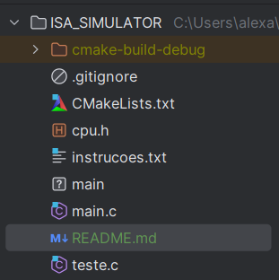

# Como executar o Projeto: "CPU ISA"
*** 

## Primeiramente:
### Dentro da Pasta, onde se encontra o seguinte arquivos


O arquivo `instrucoes.txt` é o arquivo onde será colocado o texto para ser executado pelo programa.

```
EXEMPLO DE CÓDIGO


0;i;lda 96/ldb 98
4;i;sub/xchg
8;i;lda 94/div
c;i;ldb 92/mul
10;i;ldb 90/add
14;i;sta 8e/hlt
90;d;20
92;d;3
94;d;4
96;d;5
98;d;3
```

## Em seguida execute o seguinte conjunto de comandos (Necessário ter o GCC no computador):

```
gcc -o main main.c              //Compilar 
./main                          //Executar o programa
 
```